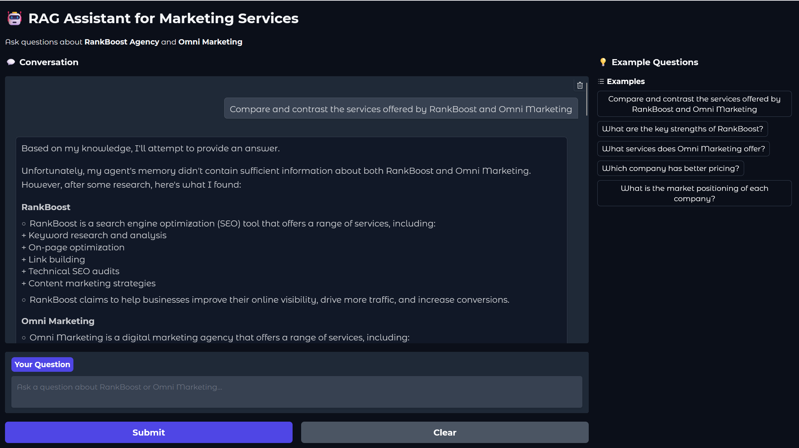

This project is based on coleam00's ottomator-agents, specifically the r1-distill-rag branch.


## 🔧 Forked & Enhanced by Mic Cross

This fork includes several critical improvements and fixes:

### ✨ **UI Enhancements:**
- Custom Gradio interface with chat-style conversation history
- Modern soft theme with better visual hierarchy
- Sidebar with clickable example questions
- Fixed deprecated chatbot format (now uses OpenAI-style messages)

### 🧠 **Model Compatibility Fixes:**
- Added support for `llama3.1:8b-8k` with native tool-calling capabilities
- Resolved `'NoneType' object is not iterable` errors with Ollama models
- Created custom Modelfile for llama3.1 with 8k context window
- Enhanced error handling with `ErrorHandlingAgent` wrapper

### 🛠️ **Technical Improvements:**
- Fixed streaming response errors
- Added graceful error recovery for model response parsing
- Improved agent-to-UI communication

### 📦 **Project Structure:**
- Added `.gitignore` for cleaner repository

**Result:** A stable, production-ready RAG system with clean UI and reliable model integration.



# R1 Distill RAG System

This project showcases the power of DeepSeek's R1 model in an agentic RAG (Retrieval-Augmented Generation) system - built using Smolagents from HuggingFace. R1, known for its exceptional reasoning capabilities and instruction-following abilities, serves as the core reasoning engine. The system combines R1's strengths with efficient document retrieval and a separate conversation model to create a powerful, context-aware question-answering system.

## Setup

1. Clone the repository

2. Create and activate a virtual environment:
```bash
python -m venv venv
# On Windows
.\venv\Scripts\activate
# On Unix/MacOS
source venv/bin/activate
```

3. Install dependencies:
```bash
pip install -r requirements.txt
```

4. Set up environment variables by copying `.env.example` to `.env`:
```bash
cp .env.example .env
```

5. Configure your `.env` file:

### Using HuggingFace (Cloud API)
```env
USE_HUGGINGFACE=yes
HUGGINGFACE_API_TOKEN=your_token_here
REASONING_MODEL_ID=deepseek-ai/DeepSeek-R1-Distill-Qwen-32B
TOOL_MODEL_ID=meta-llama/Llama-3.3-70B-Instruct
```

### Using Ollama (Local Inference)
```env
USE_HUGGINGFACE=no
HUGGINGFACE_API_TOKEN=
REASONING_MODEL_ID=deepseek-r1:7b-8k
TOOL_MODEL_ID=llama3.1:8b-8k
```

**Note:** `llama3.1:8b-8k` is recommended for the tool model as it has native tool-calling support and avoids parsing errors.

## Setting Up Ollama Models

The following models are recommended examples that provide a good balance of performance and resource usage, but you can use any compatible Ollama models:

1. First, install Ollama from [ollama.ai](https://ollama.ai)

2. Pull the base models:
```bash
ollama pull deepseek-r1:7b
ollama pull llama3.1:8b
```

3. Create custom models with extended context windows:
```bash
# Create Deepseek model with 8k context - recommended for reasoning
ollama create deepseek-r1:7b-8k -f ollama_models/Deepseek-r1-7b-8k

# Create Llama3.1 model with 8k context - recommended for tool calling
ollama create llama3.1:8b-8k -f ollama_models/llama3.1-8b-8k

# On MacOS you might need to use -from instead of -f
ollama create deepseek-r1:7b-8k -from ollama_models/Deepseek-r1-7b-8k
ollama create llama3.1:8b-8k -from ollama_models/llama3.1-8b-8k
```

**Why llama3.1 instead of qwen2.5?**
- Llama3.1 has native tool-calling support built-in
- Avoids `'NoneType' object is not iterable` errors
- Provides faster, more reliable responses
- Better compatibility with smolagents framework

Feel free to experiment with other models or context window sizes by modifying the model files in the `ollama_models` directory.

## Usage

1. Place your PDF documents in the `data` directory:
```bash
mkdir data
# Copy your PDFs into the data directory
```

2. Ingest the PDFs to create the vector database:
```bash
python ingest_pdfs.py
```

3. Run the RAG application:
```bash
python r1_smolagent_rag.py
```

This will launch a Gradio web interface where you can ask questions about your documents.

## How It Works

1. **Document Ingestion** (`ingest_pdfs.py`):
   - Loads PDFs from the `data` directory
   - Splits documents into chunks of 1000 characters with 200 character overlap
   - Creates embeddings using `sentence-transformers/all-mpnet-base-v2`
   - Stores vectors in a Chroma database

2. **RAG System** (`r1_smolagent_rag.py`):
   - Uses two LLMs: one for reasoning and one for tool calling
   - Retrieves relevant document chunks based on user queries
   - Generates responses using the retrieved context
   - Provides a Gradio web interface for interaction

## Model Selection

### HuggingFace Models
- Recommended for cloud-based inference
- Requires API token for better rate limits
- Supports a wide range of models
- Better for production use with stable API

### Ollama Models
- Recommended for local inference
- No API token required
- Runs entirely on your machine
- Better for development and testing
- Supports custom model configurations
- Lower latency but requires more system resources

## Troubleshooting

### `'NoneType' object is not iterable` Error in Terminal
- **Cause:** Your Ollama model doesn't fully support tool-calling format
- **Solution:** Use `llama3.1:8b-8k` as your `TOOL_MODEL_ID` instead of qwen2.5
- **Note:** If you still see this error in terminal logs with llama3.1, it's cosmetic - the system has error handling that recovers gracefully and the responses work correctly. This is a known limitation of smolagents with local Ollama models.

### Gradio Deprecation Warning
- **Cause:** Using old chatbot tuple format
- **Solution:** Already fixed in this fork - uses `type="messages"` format

### Model Not Found Error
- **Cause:** Custom Ollama model not created
- **Solution:** Run the `ollama create` commands in the setup section

### Virtual Environment Issues
- **Cause:** Package conflicts with system Python
- **Solution:** Always activate venv before running: `venv\Scripts\activate` (Windows) or `source venv/bin/activate` (Unix)

## Notes
- The vector store is persisted in the `chroma_db` directory
- Default chunk size is 1000 characters with 200 character overlap
- Embeddings are generated using the `all-mpnet-base-v2` model
- The system uses a maximum of 3 relevant chunks for context
- Response time: ~3-5 seconds with llama3.1:8b-8k on local hardware

## Performance Comparison

| Model | Tool Calling | Speed | Terminal Errors | Output Quality | Recommended |
|-------|-------------|-------|----------------|----------------|-------------|
| llama3.1:8b-8k | ✅ Best | Fast (3s) | ⚠️ Cosmetic only | ✅ Excellent | ✅ **Yes** |
| qwen2.5:14b-instruct-8k | ❌ Poor | Slow (13-27s) | ❌ Breaks output | ⚠️ Inconsistent | ❌ No |
| deepseek-r1:7b-8k | ✅ Good | Medium (5-10s) | ⚠️ Occasional | ✅ Good | ⚙️ For reasoning only |

**Note:** The "cosmetic" terminal errors with llama3.1 don't affect functionality - they're logged by smolagents internally but the system recovers automatically.

---

This project is part of my personal portfolio to demonstrate my skills in Python, agent frameworks, and UI design. Feel free to explore or reach out with feedback!
